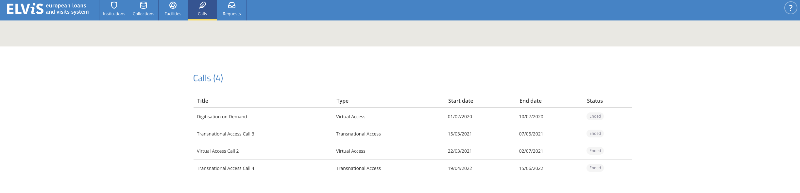
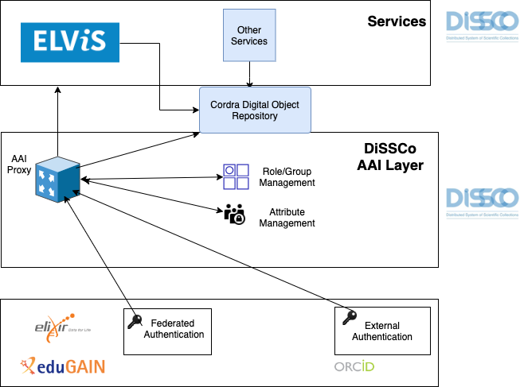
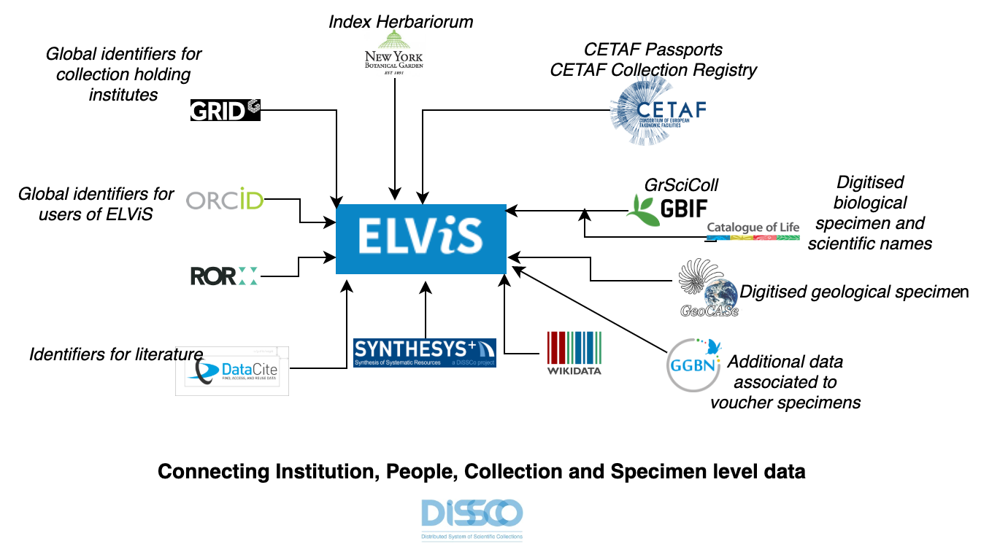

*European Loans and Visits System* 

ELViS is a service of [DiSSCo](https://dissco.eu) (Distributed System of Scientific Collections), a 
new world-class Research Infrastructure (RI) for natural science collections. ELViS will be a one-stop shop for researchers to provide access to specimens (visits, loans, digitisation on demand) in natural science collections in Europe. 

Version 1.0.0 of ELViS was a deliverable of the [SYNTHESYS+](http://www.synthesys.info/) project and used for  Transnational Access (TA) and Virtual 
Access (VA / Digitisation on Demand) programmes.

## Components 

[Backend](https://github.com/DiSSCo/elvis-backend)

[Frontend](https://github.com/DiSSCo/elvis-frontend)

Version 1.0.0 provides the following functionalities: 
- Registration for TA and VA.
- Creation of Calls
- Facilities and Institution information
- Submission and approval of the TA/VA proposal

Future roadmap: 

- Integration with DiSSCo AAI 
- Digitisation on Demand (DoD) transactions
- Loans transactions
- Visits transactions
- Peer review transactions 
- Interactive Dashboard view
- Reporting views
- Integration with Helpdesk
- Integration with DiSSCo user profiles 

 </img>

## Data Sources 

  </img>

Some of the data sources currently considered for ELViS 
(the data flow, integration details are still under discussion): 

- CETAF Passports
- CETAF Collection registry
- GrSciCol
- GRID
- ORCID
- GBIF+CoL
- GeoCase
- Index Herbariorum
- WikiData
- GGBN
- DataCite
- Synthesys portal

